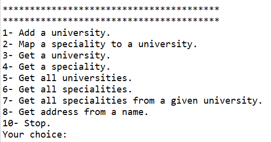
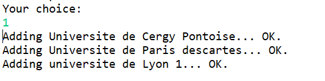
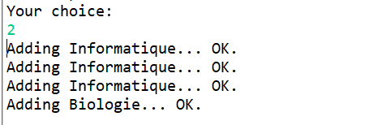
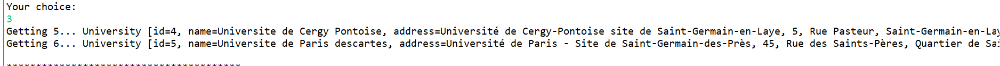
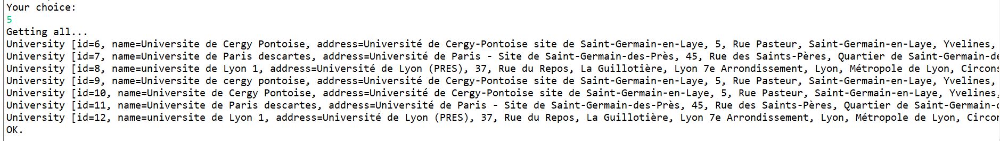
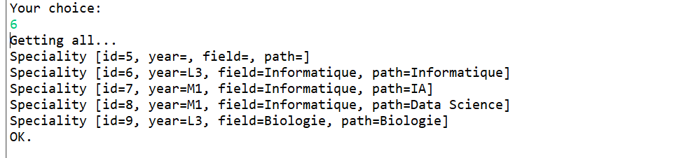
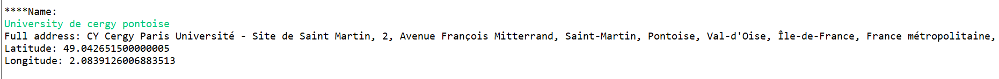
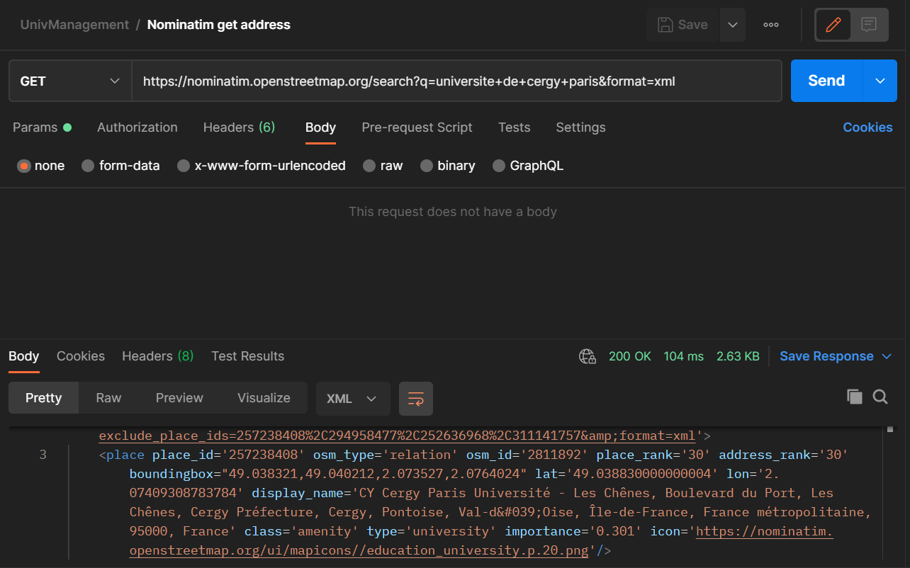
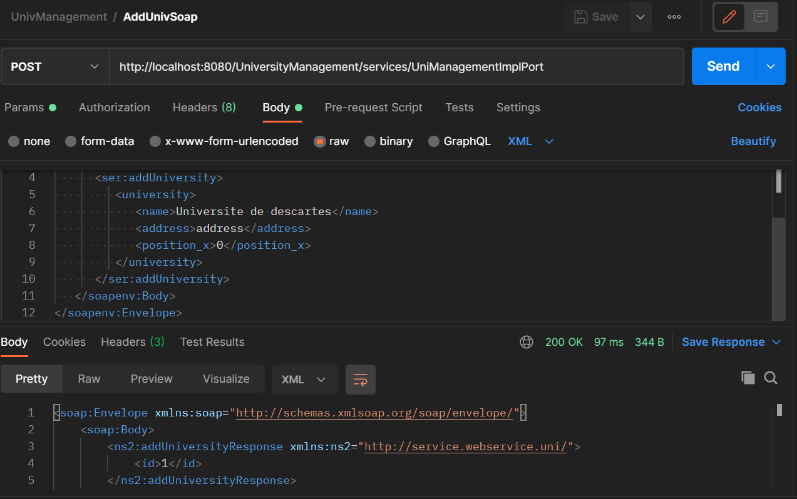
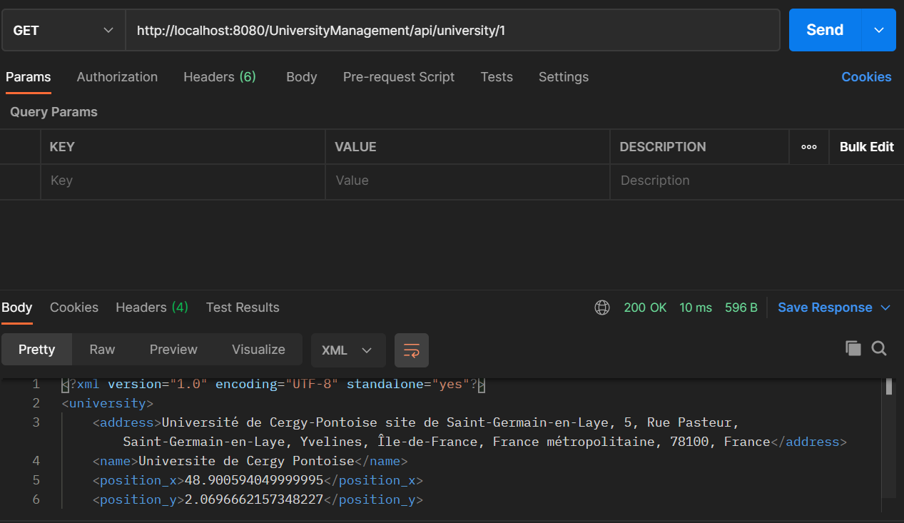

# README

## _Projet Universities Web services_

Made by the Righi-Ratovo Group (Righi Racim & Ratovo Maeva)
April 2021, at CY Paris Université en Licence Informatique 3

This project's authors can be reached through these mail adresses : rtv.maeva@gmail.com, racim458@gmail.com

In this README, we'ell see each of these points :

- The provided services
- The client
- Demonstration

## Services

The project is provided both as a SOAP and REST webservice.
Both offer the same services, here is a short description of what they are:

- Adding a university: Using a name, we generate a unique ID and add it to the Hashmap. The service then calls the Open Street Map Api **Nominatim** to get the full address, longitude and latitude of the university.
- Adding a speciality: Using a field name, year and path name, we generate a speciality and add it to the hashmap, we also map it to a university using another Hashmap that has the speciality id as key, and university id as value. This way, we can have multiple specialities in a university, but a speciality only concerns one university.
- Getting the added data: after filling the hashmaps, we can retrieve the data using the respective methods to each service. We can get a university, a speciality, a speciality in a specific university, all the universities, all the specialities, and finally all the specialities in a specific university.
- We can also delete the added data using the id's.

### WSDL

- Service endpoint: http://localhost:8080/UniversityManagement/services
- Operations: addUniversity, getUniversity, removeUniversity, addSpeciality, getSpeciality, removeSpeciality, addSpecialityToUniversity, getSpecialityFromUniversity, getAllUniversities, getAllSpecialities, getSpecialitiesFromUni.

### REST

- Web service URL: http://localhost:8080/UniversityManagement/api
- University path: http://localhost:8080/UniversityManagement/api/university/{id}
- Speciality path in a specific university: http://localhost:8080/UniversityManagement/api/university/{id_u}/speciality{id_s}
- All specialities path: http://localhost:8080/UniversityManagement/api/speciality

## Client

The client show a console menu to the user and allows him to do one of the following operations:

- Adds a university.
  
- Maps a speciality to a university.
  
- Gets a university.
  
- Gets all universities.
  
- Get all specialities.
  
- Get address from a name.
  
- Stops.

## Demonstration

To show you the functionnality of our implementation we've chosen to show you how we can add universities thanks Postman with these screenshots :

- Get address from a name.
  
- Add university SOAP
  
- Add university REST
  
- Get university REST
  
